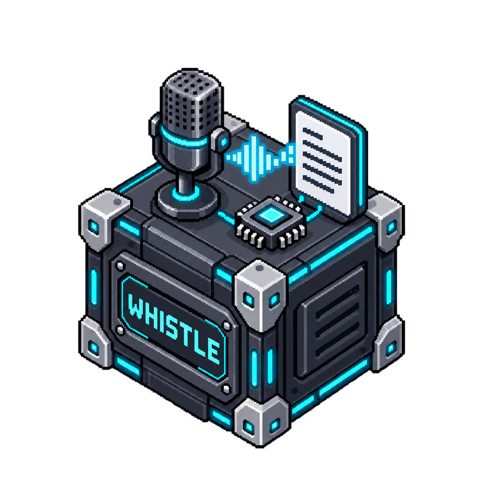

# Whistle STT



<!-- block-metadata:start -->
[](model.json)
[](compatibility.json)
[](LICENSE)

Verified BloxSmith versions: **1.0.9** (bundled-block tests; see [test evidence](compatibility.json)).
<!-- block-metadata:end -->


Run Cactus Compute's **Whistle speech-to-text model locally on the CPU**. Whistle recognizes speech; it is **not a text-to-speech model** and has no audio output. This package loads the real model, not a cloud speech API or a CLI-agent approximation.

## Connect it

Send a local audio file path to **`audio_file`**, or connect **Save Audio → `recording_ready` → Whistle STT**. The recording must be complete and no longer than 30 seconds. Configure the permitted audio directory in the modal or inspector. Relative input paths resolve inside that directory; an empty directory setting uses the application root.

Supported input containers: WAV, Ogg/Opus, WebM/Opus, FLAC, MP3, M4A and MP4 with an audio track. FFmpeg converts the first audio track to 16 kHz mono float PCM. There is **no direct `audio_stream` input, microphone capture or incremental transcript** in this initial block. Reuse Microphone Stream and Save Audio for captured clips. Longer recordings must be explicitly split upstream; the block refuses them rather than dropping the end of a sentence.

| Output | Contents |
| --- | --- |
| `text` | Final transcript only, emitted after the complete clip is processed. Silence emits no text event. |
| `result` | Final text, language, optional per-word timestamps/probabilities, durations, source SHA-256, recording correlation and model/engine versions. |
| `status` | `transcribed`, `no_speech`, `error` or `cancelled`, with safe diagnostics. |

A `recording_ready` event must contain `event`, `recording_id`, `stream_id`, an absolute `path` and `bytes`; `call_id` is optional. Its size is checked against the file and its identifiers are preserved in `result.source`. Raw microphone `start`/`stop` commands are not file-completion events and are refused. Each newly delivered message is a transcription request, including an explicitly repeated recording ID; this block does not promise durable exactly-once delivery. A different port's cached value is never replayed.

## Local model loading

Requirements: **Linux glibc on x86-64 or ARM64**, Python 3.10+ and FFmpeg on `PATH`. The package uses Needle's documented speech C API in a separate, supervised process. No Python model SDK, GPU, API key or production account is needed.

The first actual transcription downloads approximately 18 MB of public weights and the platform engine if **Download missing model assets** is enabled. Nothing downloads just because the block is added, configured, or the Run is prepared. Assets are pinned to immutable upstream revisions and verified against exact size and SHA-256 before use; the declarations are in `model_artifacts.json`.

The cache belongs to the node, under the directory returned by `context.services["get_block_storage_dir"]()`, inside `whistle-cache/`. Downloads use HTTPS and a bounded official-asset redirect policy. Audio is never uploaded. Telemetry is disabled. The cache survives Runs according to the framework storage contract. Corrupt cached files are refused and not silently replaced.

For offline preparation, run the optional helper against the intended node storage directory:

```sh
python setup_model.py --storage BLOCK_STORAGE_DIRECTORY
```

Then disable **Download missing model assets**. Alternatively, copy the correctly named, checksum-matching files described by `model_artifacts.json` into that storage directory's `whistle-cache/`. The helper does not edit a blueprint. Downloading verified vendor binaries is still a software trust decision; the first release supports the two declared Linux platforms, not every target advertised upstream.

## Settings and execution

- Automatic language detection or explicit English, German, French, Spanish, Italian, Dutch or Polish.
- Optional vocabulary hints: a JSON array of up to 32 short phrases. These influence decoding; they are not instructions to execute.
- Optional word timestamps and probabilities in JSON. Probabilities are model outputs, not correctness guarantees.
- Maximum clip duration: 30 seconds, optionally lower. Input size, processing and first-download time are bounded separately.
- The modal and inspector share draft settings: Apply commits, Cancel discards. Reload a prepared Run after changing settings.

Both Simulation/One Shot and Active Runtime perform real **local** transcription when an input is executed. Preparation alone does not run inference. Conversion and inference are serialized per activation; the framework manages event scheduling. This is clip transcription, not causal streaming ASR or an independent VAD.

Source files are never modified. Each job uses a bounded private snapshot, cleaned up at the end. Native inference runs outside the framework process because the model is process-global and not thread-safe. Stop cancels the owned process group; failed or cancelled jobs never emit partial text. Normal input/model failures appear on `status` without intentionally failing the whole Run. Temporary working copies are not an OS sandbox.

## Tests

The package tests cover input/configuration bounds, checksum and cache refusal, real-model transcription and silence, Ogg/Opus decoding, cancellation, file preservation, actual framework execution in bundled/managed/linked modes, and responsive English/French modal/inspector behavior. Duration-boundary regressions cover 8, 16, 44.1 and 48 kHz inputs and one extra sample: resampling precedes the duration gate, so overlong Opus clips cannot be silently truncated. Real-model qualification was performed on Linux x86-64; ARM64 artifacts are declared but have not been runtime-qualified here. Model files remain outside Git. The test harness supplies a checksum-verified fixture cache through `WHISTLE_TEST_CACHE`; test execution itself can stay offline. Tests use generated synthetic speech, never a user's microphone or documents. The proprietary framework harness is not redistributed in this repository.

## Upstream and license

Block code: Apache-2.0. Whistle model and Needle engine: Cactus Compute, Apache-2.0, downloaded separately and not bundled in the block repository. Their versions are independent from the block version.

References: [Whistle announcement](https://cactuscompute.com/blog/whistle), [model card and license](https://huggingface.co/Cactus-Compute/whistle), [Needle source and license](https://github.com/cactus-compute/needle), [public speech C API](https://huggingface.co/Cactus-Compute/needle3/blob/c7c415a3d1b3d929014bc6e866d51ebb971f7089/linux-x86_64/needle.h).
